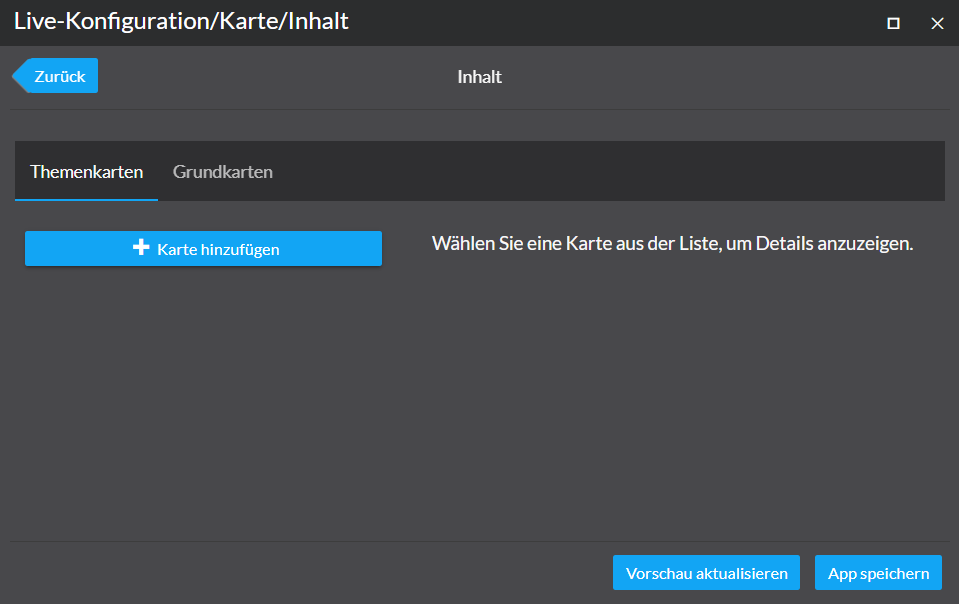

[:point_left: zurük zur Übersicht](README.md)

Aufgabe 2 - Kartenlayer hinzufügen
=====================================================

Created by con terra GmbH

In den folgenden Schritten lernen Sie, wie Sie einen neuen Kartenlayer der App hinzufügen.

1.  Öffnen Sie die App "Krankenhäuser in Hamburg" in der Live Konfiguration. Dazu wählen Sie zuerst die App aus der App Liste im map.apps Manger per Mausklick aus.
2.  Im Dialog nachfolgenden Dialog wählen Sie den "Live-Konfiguration"-Button aus.
3.  Die Karten-App startet in einem neuen Browser Tab. In der oberen rechten Ecke des App-Headers klicken Sie auf die Schaltfläche "Live-Konfiguration".
4.  Im nachfolgenden Dialog wählen Sie den ersten Menüpunkt "Karte" aus.
5.  Anschließend wählen Sie in nachfolgenden Dialog den Menüpunkt "Inhalt" aus.
    
6.  Wählen Sie den Tab Themenkarten aus. Dort klicken Sie auf den "Karte hinzufügen"-Button.
7.  Tragen Sie die Service URL im Eingabefeld URL ein und fragen anschließend die Metadaten zu dem Dienst über den "Metadaten abfragen"-Button ab. Die nachfolgenden Felder für Typ, Titel und Beschreibung werden automatisch gefüllt.

    Service URL

    [https://services2.arcgis.com/jUpNdisbWqRpMo35/ArcGIS/rest/services/HH\_Krankenh%c3%a4user\_2016/FeatureServer/0](https://services2.arcgis.com/jUpNdisbWqRpMo35/ArcGIS/rest/services/HH_Krankenh%c3%a4user_2016/FeatureServer/0)

8.  Fügen Sie die thematische Karte durch Klick auf den "Hinzufügen"-Button hinzu.
9.  Klicken Sie auf den "Vorschau aktualisieren"-Button. Die Karte wird im Hintergrund aktualisiert und die Krankenhäuser von Hamburg erscheinen auf der Karte.
10. Sie können den Dialog nun schließen.

