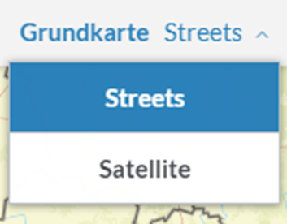

[:point_left: zurük zur Übersicht](README.md)

Aufgabe 4 - Hintergrundkarte ändern
======================================================

Created by con terra GmbH

In dieser Übung lernen Sie, wie Sie weitere Hintergrundkarten der Kartenanwendung hinzufügen können.

1.  Ändern Sie folgende Basemap -Konfiguration im Abschnitt map-init → basemaps der `app.json.`
Mögliche Basemap IDs sind in der [ESRI API for JavaScript Dokumentation](https://developers.arcgis.com/javascript/latest/api-reference/esri-Map.html#basemap). 

2.  Öffnen Sie dazu die manuelle Konfiguration. Die `app.json` ist bereits initial ausgewählt. Kopieren Sie den unteren Ausschnitt in den "basemap" Abschnitt der **`app.json.`**

    **app.json**

    ``` {.syntaxhighlighter-pre data-syntaxhighlighter-params="brush: js; gutter: false; theme: Confluence" data-theme="Confluence"}
      {
        "id": "topo",
        "title": "Topographisch",
        "basemap": "topo-vector"
     },
     {
        "id": "gray",
        "title": "Hellgrauer Hintergrund",
        "basemap": "gray-vector",
        "selected": true
     },
     {
        "id": "streets",
        "title": "Straßenkarte",
        "basemap": "streets-relief-vector"
     }
        
    ```

3.  Fügen Sie die Funktion Basemap - Toggler zur App hinzu. Mit diesem Werkzeug können Sie zwischen einzelnen Hintergrundkarten wechseln. Dazu fügen Sie das Bundle "basemaptoggler" der `allowedBundles `hinzu.

    **app.json**

    ``` {.syntaxhighlighter-pre data-syntaxhighlighter-params="brush: js; gutter: false; theme: Confluence" data-theme="Confluence"}
    {
       "load": {
          "allowedBundles": [
             "basemaptoggler",
             "coordinateviewer",
             "legend",
    ...
    ```

4.  Speichern Sie ihre Einstellungen mit dem "Speichern" - Button.
5.  Die neuen Hintergrundkarten stehen der App nun zur Verfügung.
    
    


