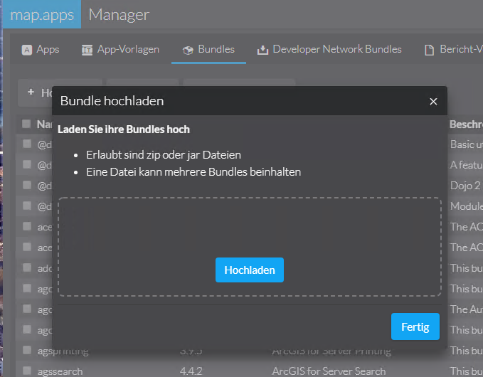

[:point_left: zurük zur Übersicht](README.md)


Augabe 11 - Domain Bundles einsetzen
=======================================================

Created by con terra GmbH

In dieser Übung soll die Konfiguration der Hintergrund-Karten in ein eigenes Domain-Bundle ausgelagert werden. Dieses Bundle könnte dann in weiteren Apps verwendet werden, damit die Hintergrundkarten immer einheitlich in allen Apps sind und schnell und einfach aktualisiert werden können.

1.  Entfernen Sie die Konfiguration der Basemaps aus der App-Konfiguration (Den kompletten Eintrag `"basemaps": [...]`).

2.  Fügen Sie folgende Bundles zur App hinzu:

    **app.json**

    ``` {.syntaxhighlighter-pre data-syntaxhighlighter-params="brush: java; gutter: false; theme: Confluence" data-theme="Confluence"}
    {
       "load": {
          "allowedBundles": [
             "domains-system",
             "domain-basemaps",
             ...
    ```

    Hinweis

    Die Hintergrundkarten werden wie zuvor angezeigt. Die Konfiguration stammt jedoch aus dem Domain-Bundle "`domain-basemaps`". 
    Damit Domain-Bundles über den Filter im Manager gefunden werden, muss ihr Name immer mit "domain-" beginnen.

3.  Öffnen Sie nun die manifest.json Datei des Domain-Bundles im Ordner [BAS10/domain-basemaps](https://github.com/conterra/mapapps-workshop-configuration/tree/main/BAS10/domain-basemaps). Dort finden Sie die Konfiguration der Basemaps wieder:

    **app.json**

    ``` {.syntaxhighlighter-pre data-syntaxhighlighter-params="brush: java; gutter: false; theme: Confluence" data-theme="Confluence"}
    {
        "name": "domain-basemaps",
        "version": "1.0.0",
        "dependencies": {
            "domains-system": "^4.3.0"
        },
         
        "main": "",
        "layer": "",
        "i18n": [],
        "domain-config": {      
            "map-basemaps": [
                   {
                      "id": "topo",
                      "title": "Topographisch",
                      "basemap": "topo-vector"
                   },
                   {
                      "id": "gray",
                      "title": "Hellgrauer Hintergrund",
                      "basemap": "gray-vector",
                      "selected": true
                   },
                   {
                      "id": "streets",
                      "title": "Straßenkarte",
                      "basemap": "streets-relief-vector"
                   }
            ],
            "map-layers": [],
            "ags-stores": []
        }
    }
    ```
4. Erstellen Sie eine lokale Datei mit dem Namen manifest.json und kopieren Sie den zuvor gezeigten Text.
4.  Ergänzen Sie nun eine weitere Basemap, z.B. aus dieser Liste: [https://developers.arcgis.com/javascript/latest/api-reference/esri-Map.html\#basemap](https://developers.arcgis.com/javascript/latest/api-reference/esri-Map.html#basemap) oder ändern Sie z.B. die beim Start selektierte Hintergrundkarte.
5.  Erstellen Sie eine neue ZIP-Datei mit der **`manifest.json`** Datei und laden Sie diese im map.apps Manager hoch.
    
    
6.  Starten Sie die App neu.

Ergebnis
--------

Die Hintergrundkarten in Ihrer App werden nun gemäß Ihrer geänderten Angaben dargestellt.


