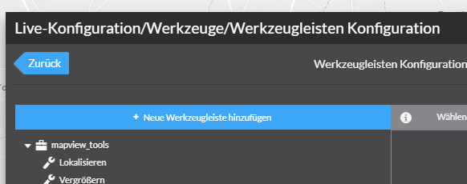
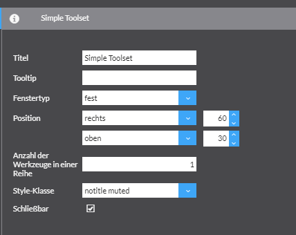
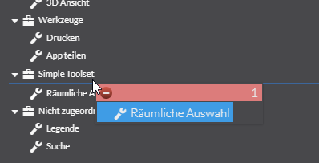
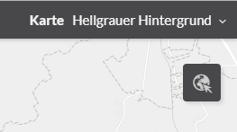

[Basis Schulung](Readme.md)

Augabe 12 - Werkzeugleiste anpassen
======================================================

Created by con terra GmbH

Die folgenden Schritte beschreiben wie sie eine neue Werkzeugleiste erstellen und das "Räumliche Auswahl" Werkzeug in diese Werkzeugleiste verschieben.

1.  Öffnen Sie  Werkzeuge \> Werkzeugleiste \> Werkzeugleisten Konfiguration in der Live-Konfiguration.
2.  Erstellen Sie eine neue Werkzeugleiste mit dem Namen "Simple Toolset"
    
    
3.  Konfigurieren Sie die Werkzeugleiste wie im folgendem Screenshot
    
    
4.  Verschieben Sie per Drag & Drop aus der Werkzeugeleiste  das "Räumliche Auswahl" Werkzeug in die Simple Toolset Werkzeugleiste.
    
    
5.  Speichern Sie die Einstellung ab
    
    

Ergebnis
--------

Auf der Karte erscheint nun die neue Werkzeugleiste mit dem im oberen rechten Kartenbereich der Anwendung.

