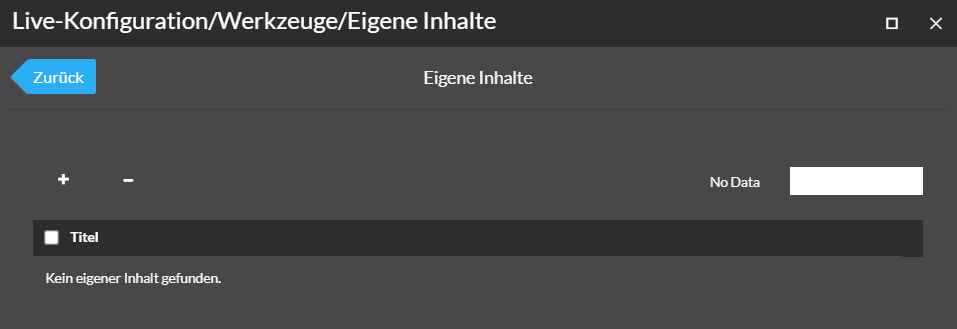
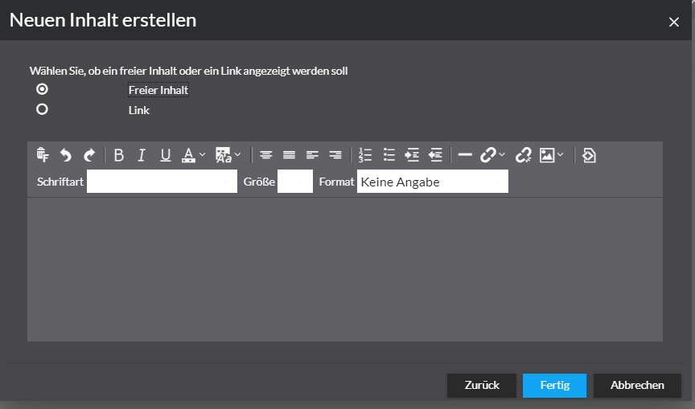
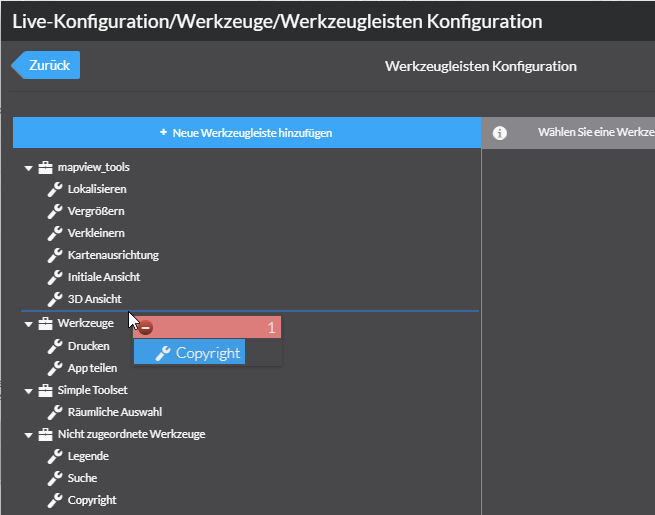
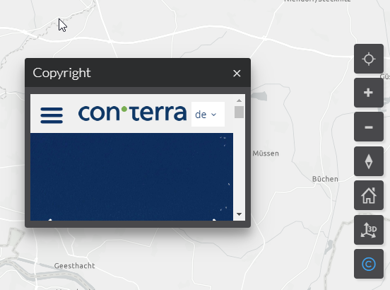

[Basis Schulung](Readme.md)

Augabe 13 - Eigene Inhalte hinzufügen
========================================================

Created by con terra GmbH

Die folgenden Schritte beschreiben wie sie eigene Inhalte einer App hinzufügen.

1.  Starten Sie die "manuelle Konfiguration" im App Manager.   
      
    
2.  Fügen Sie in der app.json im Abschnitt allowedBundles das "custominfo" Bundle hinzu und speichern die app.json mit dem "Fertig"- Button.
    
    **app.json**
    
    {
       "load": {
          "allowedBundles": \[
             "domains-system",
             "domain-basemaps",
             "custominfo",
    ....
    
3.  Öffnen Sie nun in der Live-Konfiguration den Bereich Werkzeuge > Eigene Inhalte.
    
      
      
    
4.  Einen neuen Inhalt fügen sie über den + Button hinzu. Anschließend öffnet sich ein weiterer Dialog.  
      
    
5.  Erstellen Sie einen Inhalt vom Typ "Copyright" und klicken den "Weiter"-Button.  
      
    
6.  Klicken Sie beim nachfolgenden Dialog "Fensteroptionen" auf den "Weiter"-Button.  
      
    
7.  Wählen Sie beim nachfolgendem Dialog die Option Link aus. 
    
      
    
      
    
      
      
    
8.  Tragen Sie im Eingabefeld URL folgenden Link ein: **`https://www.conterra.de/`** . Klicken Sie Abschließend den "Fertig"-Button.  
      
    

Der Inhalt ist nun in der App registriert. Sie müssen nun noch ein Werkzeug-Icon für den Aufruf des Copyright Dialoges auf der Karte einfügen.

  

1.  Öffnen Sie dazu in der Live-Konfiguration den Bereich Werkzeuge > Werkzeugleisten Konfiguration.  
      
    
2.  Verschieben Sie per Drag & Drop das "Copyright"**`-`**Werkzeug in die "mapview\_tools"-Werkzeugleiste und aktualisieren die App mit dem "Vorschau aktualisieren"-Button.  
      
      
    
3.  Der Copyright-Dialog ist nun auf der Karte eingefügt und lässt sich über das "Copyright"-Werkzeug in der rechten Werkzeugleiste öffnen.  
    

    